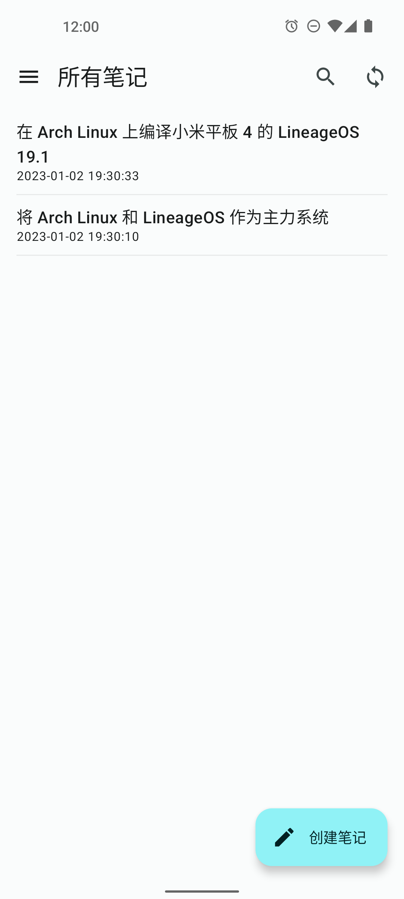
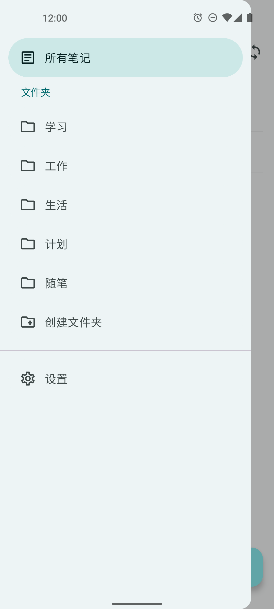
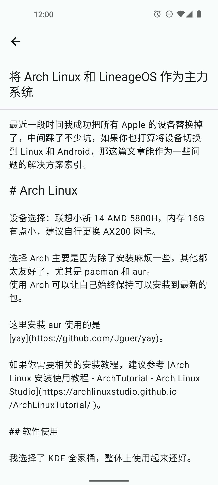
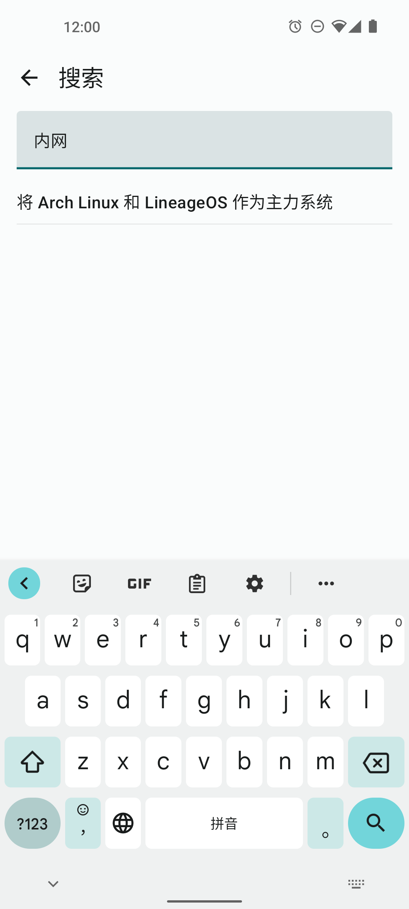
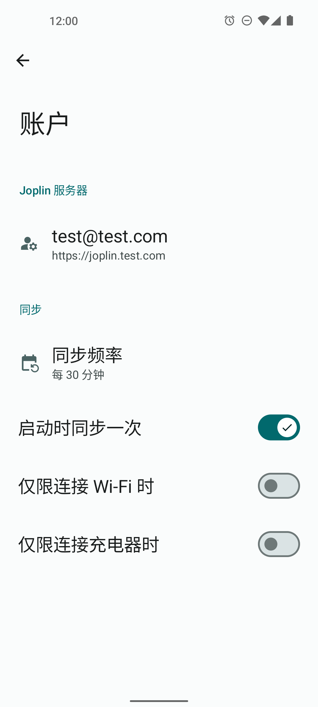

<div align="center">
<div align="center">
    <h1>Noteslab</h1>
    <p>A simple notes application that supports syncing notes using a self-hosted Joplin server.</p>
    <p>English by DeepL&nbsp;&nbsp;|&nbsp;&nbsp;<a target="_blank" href="./README-zh-CN.md">简体中文</a></p>
</div>

[](https://github.com/hgwebs1/noteslab/actions/workflows/build.yml)
[](https://github.com/hgwebs1/noteslab/blob/main/LICENSE)
[](https://github.com/hgwebs1/noteslab/releases)
[](https://github.com/hgwebs1/noteslab/releases)
[](https://fosstodon.org/@noteslab)

<div align="center">
    
    
    
    
    
    <br/>
    <br/>
</div>
</div>

🚧 Currently in Pre-alpha, not ready for use in production environments. Please be careful to back up. 🚧

Supported features:

- ✅ Support Markdown edit and preview
- ✅ Full-text search using jieba-rs (Chinese and English supported)
- ✅ Sync notes using a self-hosted Joplin server
- ✅ Manual and automatic synchronization
- 🚧 Possible compatibility with Joplin's sync format (End-to-end encryption is not supported)

## Download

[](https://f-droid.org/packages/org.hgwebs.noteslab/)
[](https://play.google.com/store/apps/details?id=org.hgwebs.noteslab)
[](https://github.com/hgwebs1/noteslab/releases)
 or [nightly](https://github.com/hgwebs1/noteslab/releases/tag/nightly).

> Noteslab is a reproducible build of app, you don't need to worry about F-Droid and other store signature issues, see: [Towards a reproducible F-Droid](https://f-droid.org/en/2023/01/15/towards-a-reproducible-fdroid.html).


## Translation

Please help to translate with the [Weblate](https://toolate.othing.xyz/projects/noteslab/) 

<a href="https://toolate.othing.xyz/projects/noteslab/">

</a>


## Build

The following instructions are based on a Linux development environment and an arm64 physical device for debugging.

### Requirements

- [Rust 1.75.0](https://www.rust-lang.org/tools/install)
- [Android Studio](https://developer.android.com/studio)
- [NDK 27.1.12297006](https://developer.android.com/ndk/downloads)

### Build Instructions

#### 1. You need to set the NDK environment variable.

Example:

```shell
export ANDROID_HOME=$HOME/Android/Sdk
export NDK_VERSION=27.1.12297006
```

#### 2. Build the Rust library.

> You can learn about how Kotlin interoperates with Rust from [uniffi-rs](https://github.com/mozilla/uniffi-rs).

Run `build.sh` in the `noteslab-data-uniffi` directory.

```shell
cd noteslab-data-uniffi
./build.sh
```

#### 3. Build the apk.

```shell
./gradlew :app:assembleDebug
```

> For more build details, refer to [Github Actions](.github/workflows).

## Credits

- [Joplin](https://github.com/laurent22/joplin): [AGPL-3.0](https://github.com/laurent22/joplin/blob/dev/LICENSE)
- [ReadYou](https://github.com/Ashinch/ReadYou): [GPL-3.0](https://github.com/Ashinch/ReadYou/blob/main/LICENSE)
- [Seal](https://github.com/JunkFood02/Seal): [GPL-3.0](https://github.com/JunkFood02/Seal/blob/main/LICENSE)

## License

[GNU GPL v3.0](https://github.com/hgwebs1/noteslab/blob/main/LICENSE)
